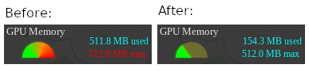

# L.TileLayer.Canvas
Render Leaflet's tiles as `<canvas>` elements.

## Why?
If your project has a lot of layers, sometimes performance issues related to GPU may occurred. In our case the easiest way to avoid them is displaying map's tiles not as `` elements, but draw their on the `<canvas>`. Just look:
<p align="center">
  
</p>

## How to use it?
You can install it via package manager:
```
npm install tilelayer-canvas
```
or
```
yarn add tilelayer-canvas
```
or just copy `index.min.js` from this repository and include it by `<script>` tag:
```js
<script src="./path/to/index.min.js"></script>
```

Then in your project use `L.tileLayer.canvas` instead of `L.tileLayer`. That's it! [See an example](./example/index.html).

## Changelog
**1.1.0** - 24/07/2020
* Added canvas charging delay support
* Added options
```
timeout: Number - delay time (ms)
```

**1.0.2** - 09/06/2020
* Added `complete` attribute to `<canvas>` element (fixed blinked zoom issue).

**1.0.1** - 06/05/2020
* Fixed npm package name.

## License
MIT
